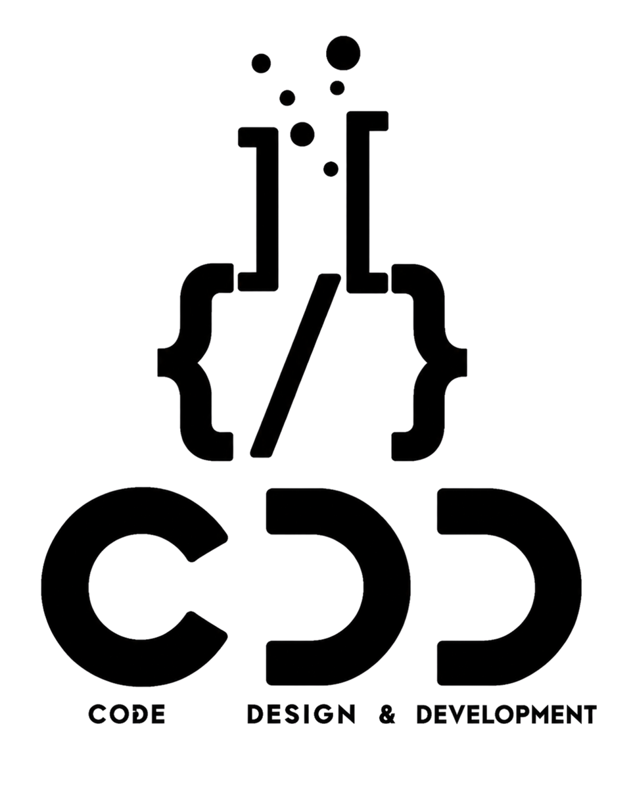

<div align="center">

  

  # Idea and Innovation Cell (IIC PMEC / CDD×SIC)
  ### Official Web Portal & Digital Hub
  **Parala Maharaja Engineering College, Berhampur, Odisha**

  <p align="center">
    <strong>Bridging Ideas to Reality Through Technology, Design, and Innovation</strong>
  </p>

  <p align="center">
    <a href="https://iicpmec.vercel.app"></a>
    <a href="https://www.linkedin.com/in/idea-and-innovation-cell-pmec-838392431"></a>
    <a href="https://www.instagram.com/ideainnovationcell.pmec"></a>
    <a href="mailto:ideainnovationcell.pmec@gmail.com"></a>
  </p>

</div>

---

## 🌟 Overview

The **Idea and Innovation Cell (IIC)** official web platform represents the collective vision of **Coding, Design & Development (CDD)** and the **Student Innovation Center (SIC)** at **Parala Maharaja Engineering College (PMEC), Berhampur**.

It serves as the digital hub showcasing student-led initiatives, production-grade technical projects, upcoming workshops & hackathons, curated interactive galleries, club leadership, and automated community outreach systems.

---

## ✨ Key Features

- ⚡ **Modern Dynamic Frontend:** Built on Next.js 14 App Router, React 18, and Tailwind CSS with custom glassmorphism design.
- 🎨 **Fluid Micro-Animations:** Motion powered by Framer Motion, interactive 3D hero card, and smooth navigation.
- 👥 **Team & Leadership Showcase:** Dedicated carousel galleries for Faculty Advisors, Executive Board, Social Media & Content Wing, Core Committee, and Alumni network.
- 🚀 **Projects Directory:** Interactive versioned project portfolio showcasing live links, source code, and release notes.
- 📸 **High-Performance Event Gallery:** Categorized photo memories and highlight carousel optimized with Cloudinary CDN.
- 💌 **Automated Newsletter & Contact System:** MongoDB Atlas persistence + Resend / Nodemailer transactional email delivery with custom HTML templates.
- 🔍 **Enterprise SEO & JSON-LD:** Structured schema nodes (Organization, Persons, SoftwareApplications, Events, FAQs) and dynamic OpenGraph assets.
- 🌲 **Linktree / Social Hub (`/links` & `/linktree`):** Built-in centralized link aggregator for campus announcements and social portals.

---

## 🛠️ Tech Stack

| Layer | Technologies |
|---|---|
| **Framework** | [Next.js 14](https://nextjs.org/) (App Router, Server Actions, Dynamic API Routes) |
| **Styling** | [Tailwind CSS](https://tailwindcss.com/), Vanilla CSS Tokens, Glassmorphism |
| **Animations** | [Framer Motion](https://www.framer.com/motion/), [Lucide React](https://lucide.dev/) Icons |
| **Database** | [MongoDB Atlas](https://www.mongodb.com/atlas) with Mongoose / Native Driver |
| **Media & CDN** | [Cloudinary](https://cloudinary.com/) (Optimized WebP transformation) |
| **Email Service** | [Resend](https://resend.com/) & [Nodemailer](https://nodemailer.com/) (SMTP fallback) |
| **Deployment** | [Vercel](https://vercel.com/) with automated CI/CD and cron keep-alive |

---

## 📁 Repository Structure

```text
CDD2.O/
├── frontend/
│   ├── app/                      # Next.js 14 App Router routes & API endpoints
│   │   ├── api/                  # Contact, newsletter, broadcast & cron routes
│   │   ├── links/ & linktree/    # Centralized club linktree portals
│   │   ├── layout.js             # Root layout with Person & Org JSON-LD schema
│   │   └── page.js               # Landing page orchestrator
│   ├── components/cdd/           # Modular UI & section components
│   │   ├── HeroSection.jsx       # Interactive 3D hero
│   │   ├── TeamSection.jsx       # Faculty, Board, Social Media & Alumni carousels
│   │   ├── ProjectsSection.jsx   # Project showcase with version histories
│   │   ├── GallerySection.jsx    # Categorized media & event photos
│   │   └── ContactSection.jsx    # Contact form & newsletter subscription
│   ├── lib/                      # Constants, MongoDB client, schemas & preloading
│   ├── public/                   # Static assets, branding logos & manifest
│   └── tailwind.config.js        # Theme & token extensions
├── README.md                     # Project documentation
└── package.json
```

---

## 🚀 Getting Started Locally

### 1. Clone the Repository
```bash
git clone https://github.com/Ayushmancodes-08/CDD2.O.git
cd CDD2.O/frontend
```

### 2. Install Dependencies
```bash
npm install
```

### 3. Configure Environment Variables
Create a `.env.local` file inside the `frontend/` directory:
```env
# MongoDB Atlas Connection
MONGODB_URI=mongodb+srv://<username>:<password>@cluster.mongodb.net/cdd?retryWrites=true&w=majority

# Email Service (Resend or SMTP)
RESEND_API_KEY=re_xxxxxxxxxxxx
EMAIL_HOST=smtp.gmail.com
EMAIL_PORT=465
EMAIL_USER=ideainnovationcell.pmec@gmail.com
EMAIL_PASS=your_app_password
CONTACT_EMAIL_TO=ideainnovationcell.pmec@gmail.com

# Site URL
NEXT_PUBLIC_SITE_URL=https://iicpmec.vercel.app
```

### 4. Run Development Server
```bash
npm run dev
```
Open [http://localhost:3000](http://localhost:3000) in your browser.

### 5. Production Build
```bash
npm run build
npm run start
```

---

## 📬 Contact & Community

- 🌐 **Live Website:** [https://iicpmec.vercel.app](https://iicpmec.vercel.app)
- 📧 **Email:** [ideainnovationcell.pmec@gmail.com](mailto:ideainnovationcell.pmec@gmail.com)
- 💼 **LinkedIn:** [Idea and Innovation Cell - PMEC](https://www.linkedin.com/in/idea-and-innovation-cell-pmec-838392431)
- 📸 **Instagram:** [@ideainnovationcell.pmec](https://www.instagram.com/ideainnovationcell.pmec)
- 🏢 **Campus Address:** Room 113, Academic Main Building, Parala Maharaja Engineering College (PMEC), Sitalapalli, Berhampur, Odisha – 761003

---

<div align="center">

*"Build. Innovate. Collaborate. Impact."*  
**Made with ❤️ by Idea and Innovation Cell (IIC PMEC / CDD×SIC)**

</div>
